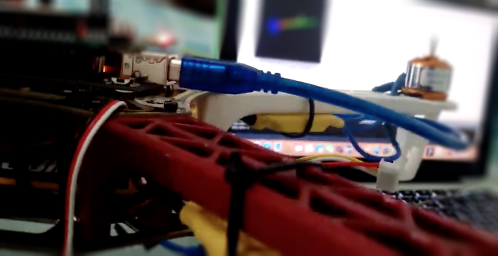

Disclaimer
==========

Before testing this code, make sure to remove your propellers. Otherwise, you could hurt yourself.

LibrixFlightProject
===================

Development of the LibrixFlight project.

LibrixFlight is a development flight controller shield for Arduino.

* FlightController -> Main Program

Versions
========

Please do not test the code in development phase.
Only test final versions:

[https://github.com/librixsoft/librix-flight](https://github.com/librixsoft/librix-flight)

Instructions for Use
====================

1. Power the Arduino board.
2. Synchronize radio transmitter / receiver.
3. Keep the Throttle joystick at point 0.
4. Connect the battery.

Calibration Mode
================

1. Power the Arduino board.
2. Synchronize radio transmitter / receiver.
3. Keep the Throttle joystick at maximum point.
4. Connect the battery.

Unit Testing
============

* test -> Sensors, Boards, Console, Extensions, Tests

Compilation
===========

To compile the source code, you will need to import all the libraries found in the /lib/ folder.

* Import -> Add Library

Restart Arduino IDE.

Note: Add libraries to the Arduino "libraries" folder.

PS: Thanks to the community that has reported compilation errors.
If you find any, please report it.

General Notes
=============

Open Hardware and Open Source Software.

Under BSD license.

Community
=========

The project has been shared in Arduino communities where users have shared ideas and proposed features that will soon be added, such as: artificial intelligence, improvements, and contributions.

License
=======

This program is free as long as you respect the author's credits, references, and attach the source code.

Author: LibrixSoft <hola@librixsoft.com>

2024, All rights reserved.
